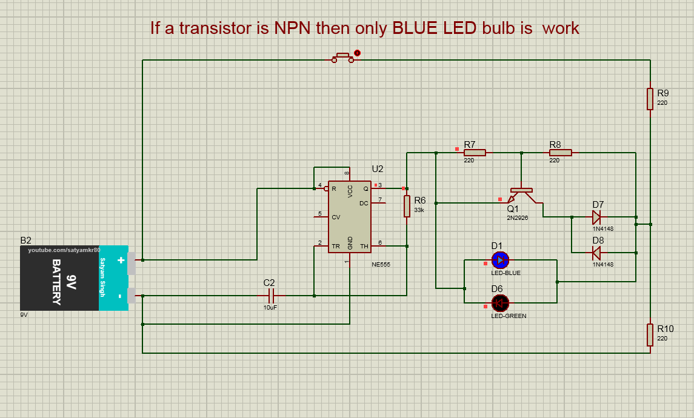
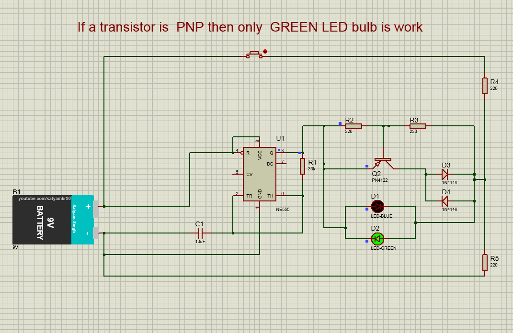
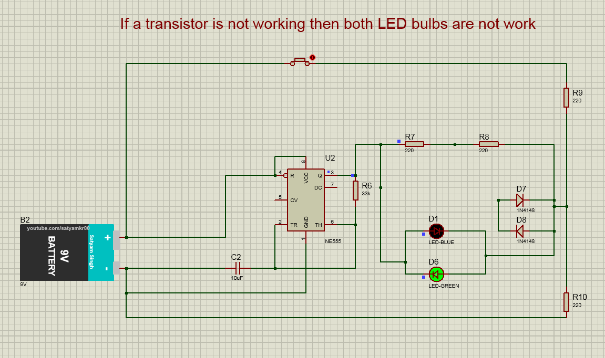
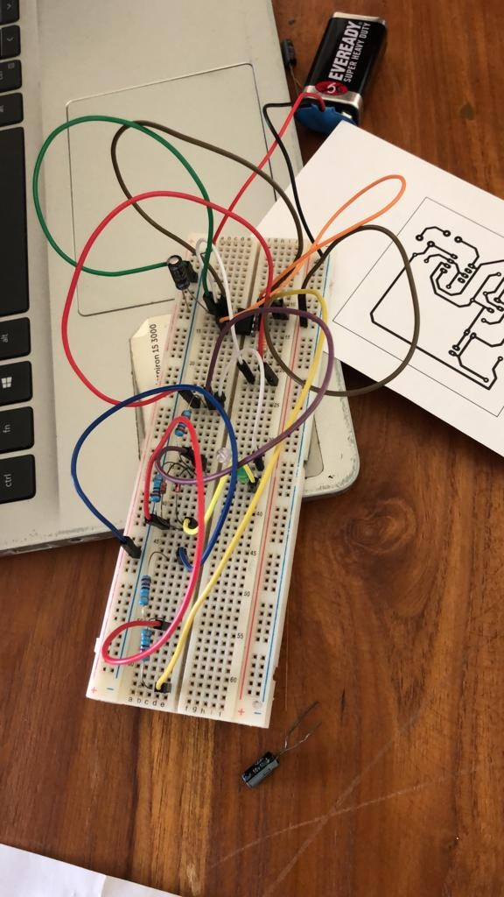
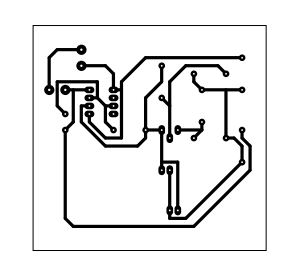
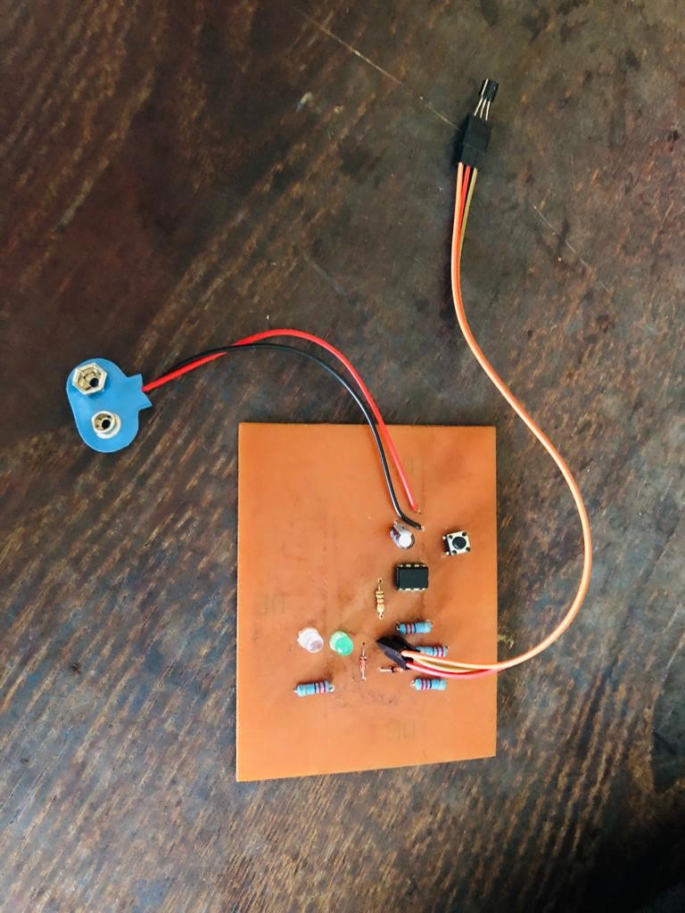
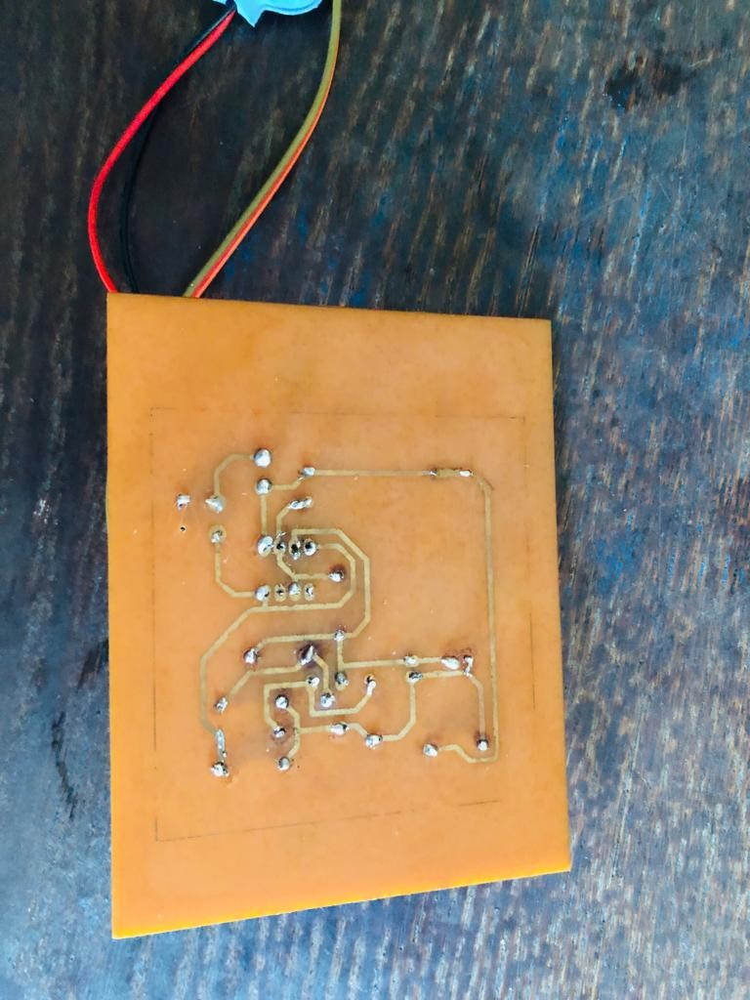

# Transistor Tester using 555 Timer IC

## Introduction
This project involves developing a PCB for a simple electronic circuit using a 555 Timer IC to create a transistor tester. The tester uses LEDs to indicate the functionality of NPN and PNP transistors. 

## Topic
**Transistor Tester using 555 Timer IC**

## Aim
To familiarize with the PCB design and development.

## Apparatus

### Implement the Circuit
- 33k Ω Resistors - 1
- 220 Ω Resistor - 4
- 555 Timer IC
- LED 2 (Blue and Green)
- 9V battery
- 10 uF capacitor
- Copper plate
- Push button
- 1N4148 diode - 2

### Implement the PCB Board
- Copper plate
- Photo paper
- FeCl3
- Thinner (to clean the PCB board after printing the circuit)
- Drilling machine
- Cutting machine
- Breadboard
- Soldering machine
- Iron
- Lead wire

## Circuit Explanation
The 555 timer integrated circuit (IC) is known for its versatility and is used here in conjunction with PNP and NPN transistors to create a transistor tester. Depending on the type of transistor connected, different LEDs will light up to indicate the transistor's functionality. If neither transistor works, both LEDs will light up, signaling a fault.

*Figure 01: Only the blue LED lights up when the NPN transistor is working.*

*Figure 02: Only the green LED lights up when the PNP transistor is working.*

*Figure 03: Both LEDs light up when the transistor is faulty.*

## Design and Implementation

### Circuit Design
The circuit is designed to indicate the status of NPN and PNP transistors using LEDs and a 555 Timer IC.

*Figure 04: Connecting the circuit on the board.*

### PCB Layout
The PCB layout is created for the circuit, ensuring a compact and efficient design.

*Figure 05: PCB layout of the circuit.*

### PCB Fabrication Steps
1. Print the PCB layout on photo paper.
2. Cut the copper plate to the suitable size using a cutting machine.
3. Clean the copper plate with a wire brush to remove surface oxide and dust.
4. Iron the printed layout onto the copper plate for 5 to 10 minutes.
5. Cool the plate under running water and gently remove the paper.
6. Fill in any missing areas with a permanent marker pen.
7. Etch the copper plate using FeCl3 to remove unwanted copper.
8. Wash and dry the plate, then drill holes for component insertion.
9. Clean the board with thinner and position the components.
10. Solder the components onto the board, adding jumper wires as needed.

*Figure 06: Plane view of the PCB.*

*Figure 07: Bottom view of the PCB.*

## Challenges
- Managing a small copper plate during fabrication.
- Limited access to equipment and machinery due to multiple groups in the lab.
- Issues with overheating and melting the printed circuit path.
- Insufficient FeCl3 concentration requiring more time and chemicals for etching.
- Limited soldering practice requiring careful and patient work.

## Reflection
This project provided valuable hands-on experience in PCB design, fabrication, and testing. It highlighted the importance of precision, teamwork, and effective communication. We gained confidence in handling PCB manufacturing tasks and developed critical thinking and problem-solving skills during the testing and troubleshooting phases.

## Discussion
The project successfully demonstrated the creation of a transistor tester using a 555 Timer IC, providing a practical tool for testing and characterizing transistors. The design can be further expanded to support more transistor types or integrate a display for real-time readings.

## Conclusion
The project emphasizes the importance of precise PCB construction, proper component placement, and soldering techniques in developing reliable electronic circuits. The Transistor Tester circuit is a useful tool for electronics enthusiasts, hobbyists, and professionals.

## Applications of 555 Timer
The 555 timer is used in various applications, including:
1. Oscillators
2. Timer and delay circuits
3. Pulse Width Modulation (PWM)
4. Voltage-Controlled Oscillators (VCO)
5. Sequential logic with flip-flops
6. Touch or proximity switches
7. LED flashers and light effects

